# Memory Agent MCP System - Data Flow Analysis

## Overview

This document analyzes the complete data flow for users interacting with the Memory Agent MCP system, from initial query to final response, including all data transformations, storage operations, and system interactions.

## High-Level Data Flow

```mermaid
graph TB
    %% User Input Layer
    User[👤 User] -->|Query| Client[🖥️ Client Application]
    Client --> |MCP Protocol| MCPServer[🔌 MCP Server]
    
    %% Client Types
    Client --> Claude[Claude Desktop]
    Client --> LMStudio[LM Studio]
    Client --> ChatGPT[ChatGPT via HTTP]
    Client --> CLI[Chat CLI]
    
    %% MCP Server Layer
    MCPServer --> |use_memory_agent()| Agent[🧠 Memory Agent]
    
    %% Agent Processing
    Agent --> |1. Parse Query| Parser[📝 Query Parser]
    Agent --> |2. Apply Filters| FilterEngine[🔒 Filter Engine]
    Agent --> |3. Generate Response| LLM[🤖 LLM Backend]
    
    %% LLM Backend Options
    LLM --> OpenAI[OpenAI API]
    LLM --> vLLM[vLLM Server]
    LLM --> MLX[MLX Models]
    
    %% Memory Operations
    Agent --> |4. Execute Code| Sandbox[⚡ Sandboxed Engine]
    Sandbox --> |Memory Operations| Tools[🛠️ Memory Tools]
    
    %% Storage Layer
    Tools --> |Read/Write| FileSystem[💾 File System]
    FileSystem --> UserMD[user.md]
    FileSystem --> EntitiesDir[entities/]
    
    %% Response Flow
    Sandbox --> |Results| Agent
    Agent --> |Final Response| MCPServer
    MCPServer --> |MCP Protocol| Client
    Client --> |Display| User
    
    %% Configuration Files
    ConfigFiles[⚙️ Config Files] --> Agent
    ConfigFiles --> MemoryPath[.memory_path]
    ConfigFiles --> Filters[.filters]
    ConfigFiles --> ModelName[.mlx_model_name]
```

## Detailed Data Flow Stages

### 1. User Query Initiation

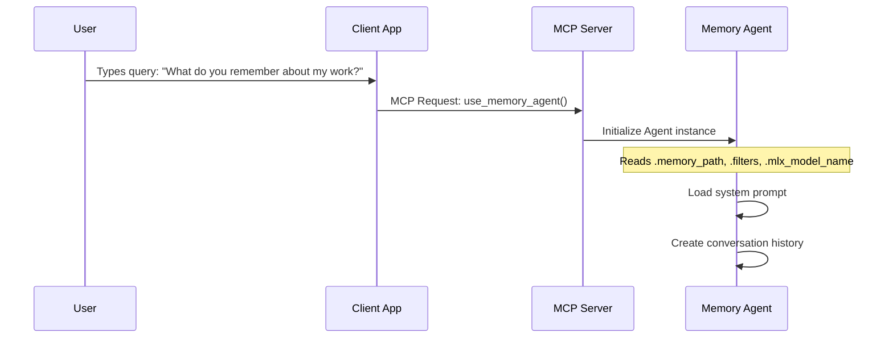

### 2. Query Processing & LLM Interaction

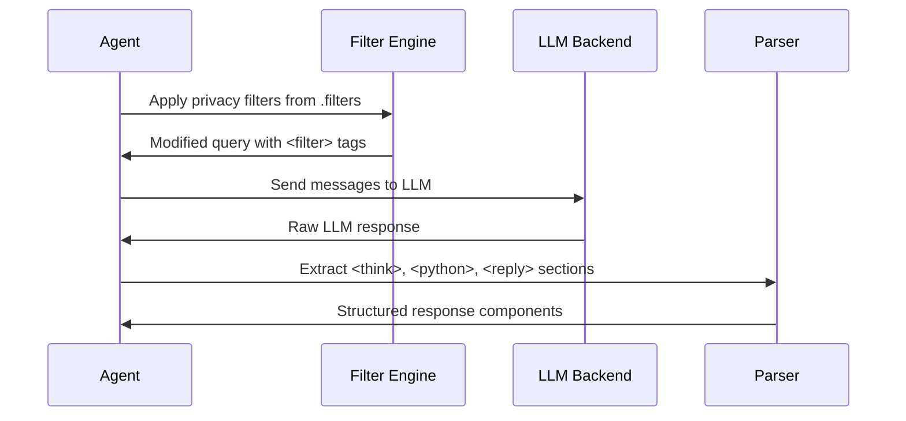

### 3. Memory Operations in Sandbox

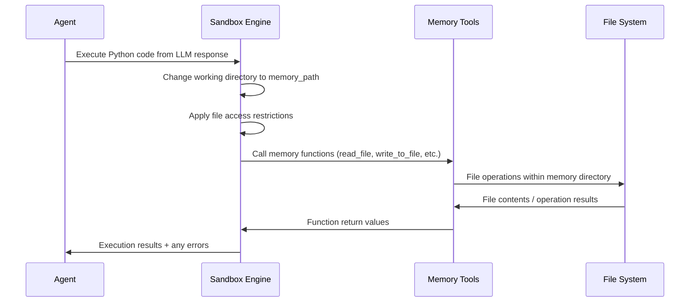

### 4. Memory Structure & Entity Management

```mermaid
graph LR
    subgraph "Memory Directory Structure"
        MemDir[memory/]
        UserFile[user.md]
        EntDir[entities/]
        
        MemDir --> UserFile
        MemDir --> EntDir
        
        subgraph "Entity Files"
            PersonA[john_doe.md]
            CompanyA[acme_corp.md]
            ConceptA[project_x.md]
        end
        
        EntDir --> PersonA
        EntDir --> CompanyA
        EntDir --> ConceptA
    end
    
    subgraph "Entity Relationships"
        UserFile -.->|[[entities/acme_corp.md]]| CompanyA
        UserFile -.->|[[entities/john_doe.md]]| PersonA
        CompanyA -.->|[[entities/john_doe.md]]| PersonA
    end
```

### 5. Response Generation & Multi-Turn Processing

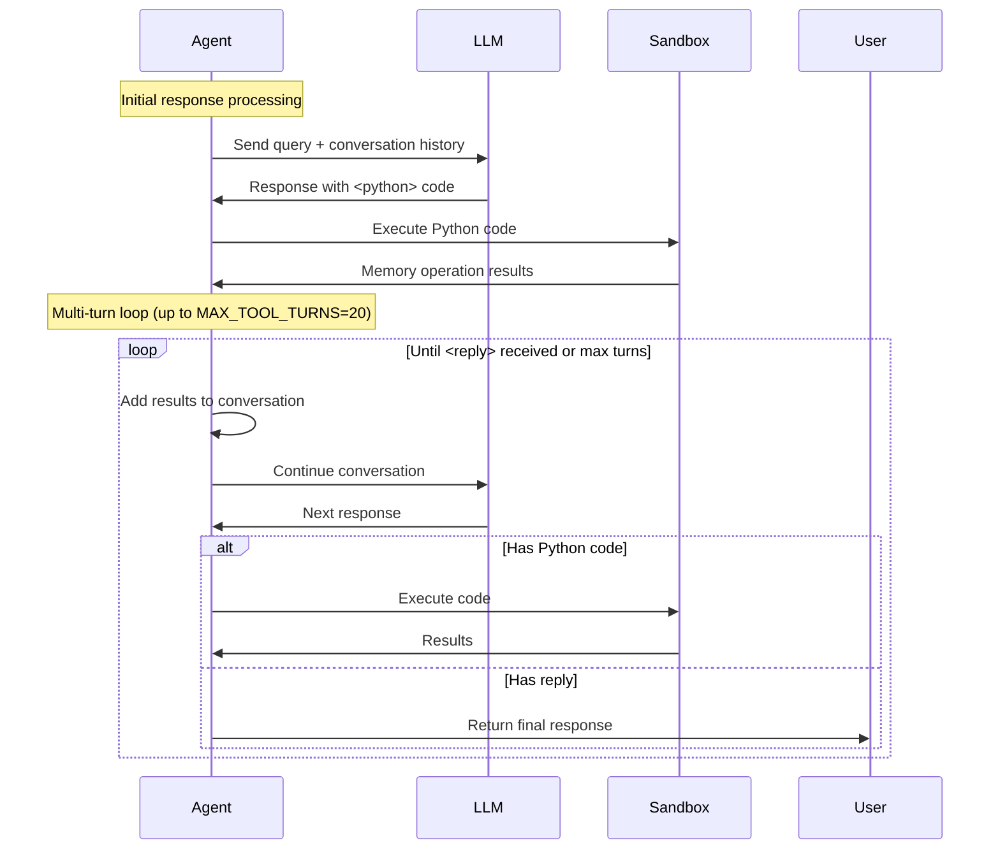

## Data Transformations

### 1. Query Filter Application

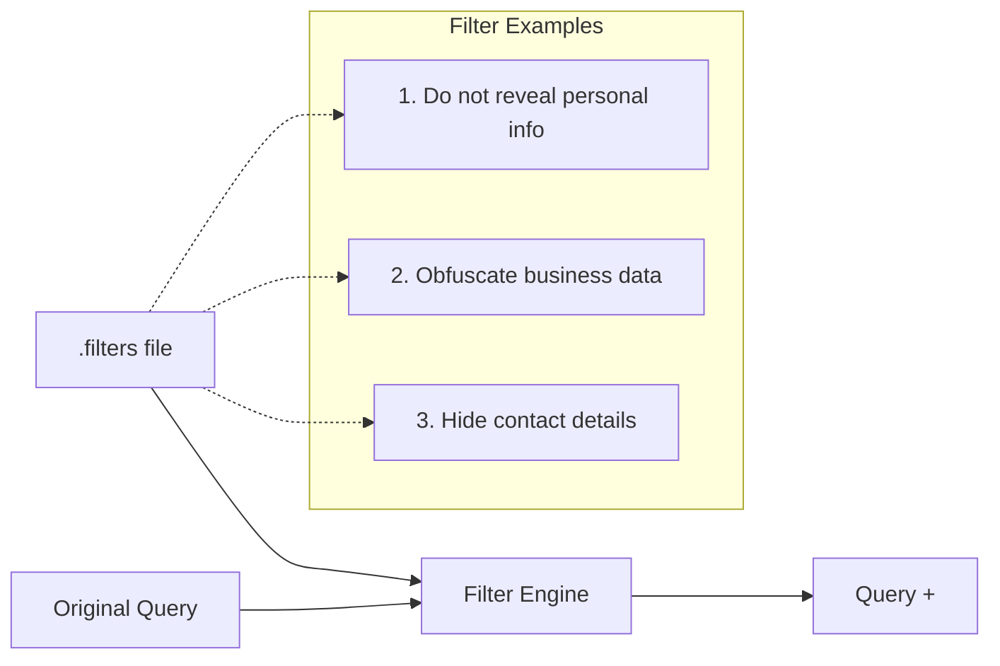

### 2. LLM Response Parsing

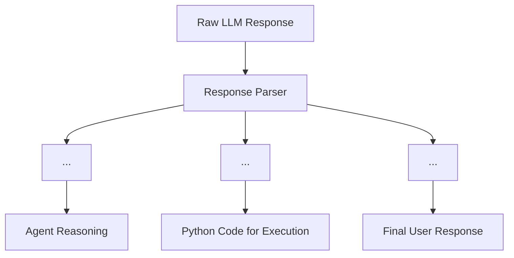

### 3. Memory File Operations

```mermaid
graph LR
    subgraph "Read Operations"
        ReadFile[read_file()] --> FileContent[File Content]
        FollowLink[follow_link()] --> LinkedContent[Linked File Content]
        ListFiles[list_files()] --> FileList[Directory Listing]
    end
    
    subgraph "Write Operations"
        WriteFile[write_to_file()] --> NewFile[Create/Update File]
        UpdateFile[update_file()] --> ModifiedFile[Modified File]
        CreateDir[create_directory()] --> NewDir[New Directory]
    end
    
    subgraph "Entity Link Resolution"
        ObsidianLink["[[entities/name.md]]"] --> FilePath[entities/name.md]
        FilePath --> FileAccess[File Read/Write]
    end
```

## Memory Connector Data Flow

```mermaid
graph TB
    subgraph "Data Source Integration"
        Sources[Data Sources] --> Connectors[Memory Connectors]
        
        Sources --> ChatGPTZip[ChatGPT Export .zip]
        Sources --> NotionZip[Notion Export .zip]
        Sources --> GitHubAPI[GitHub Live API]
        Sources --> GoogleDocs[Google Docs API]
    end
    
    subgraph "Connector Processing Pipeline"
        Connectors --> Extract[extract_data()]
        Extract --> Organize[organize_data()]
        Organize --> Generate[generate_memory_files()]
    end
    
    subgraph "Memory Output"
        Generate --> UserMD[user.md]
        Generate --> EntityFiles[entities/*.md]
        Generate --> Relationships[Entity Links]
    end
    
    EntityFiles --> MemorySystem[Memory Agent System]
    UserMD --> MemorySystem
    Relationships --> MemorySystem
```

## Platform-Specific Data Flows

### macOS with MLX Models

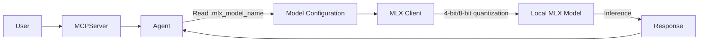

### Linux with vLLM

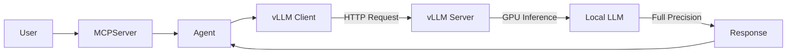

### Cloud API Integration

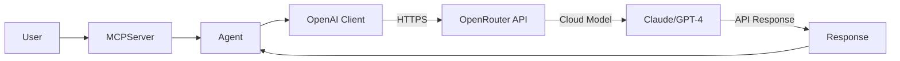

## Error Handling & Recovery

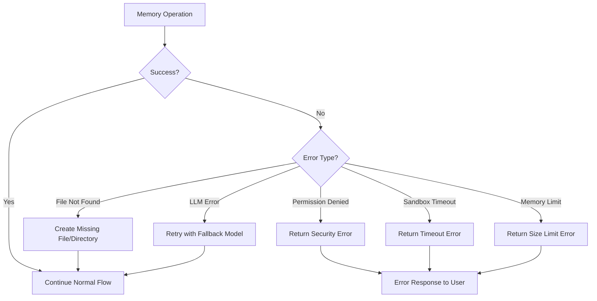

## Performance Considerations

### Memory Access Patterns

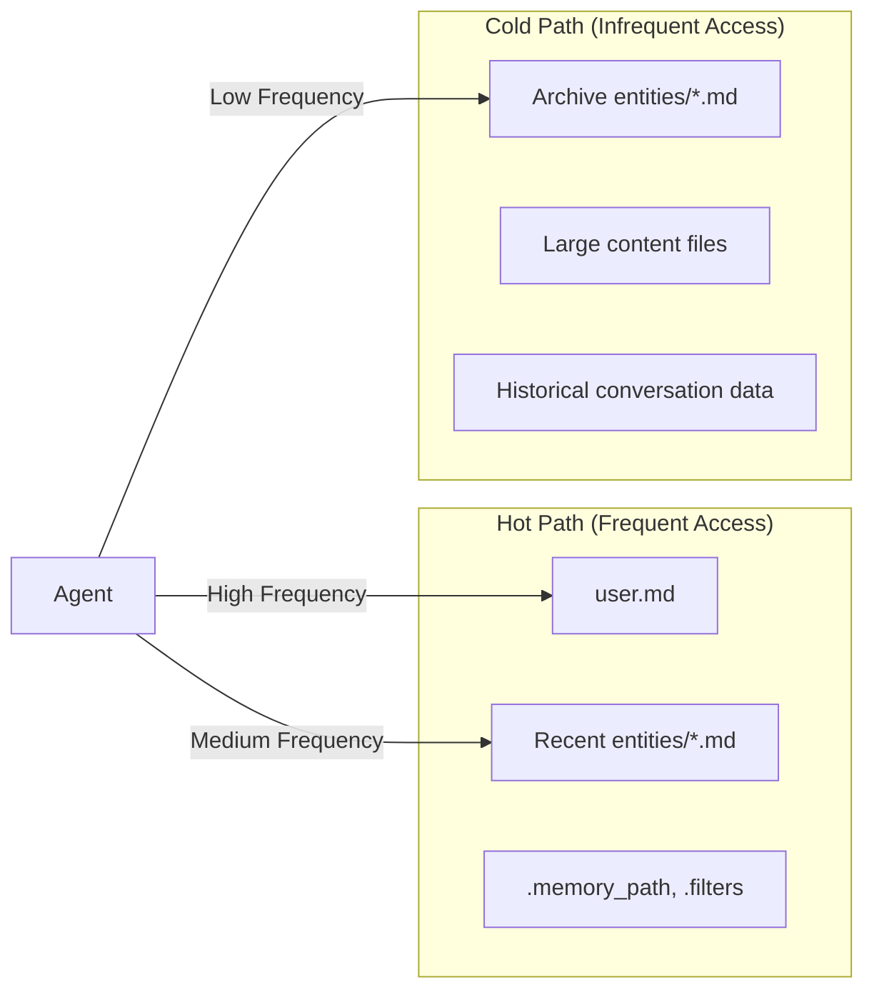

### Caching Strategy

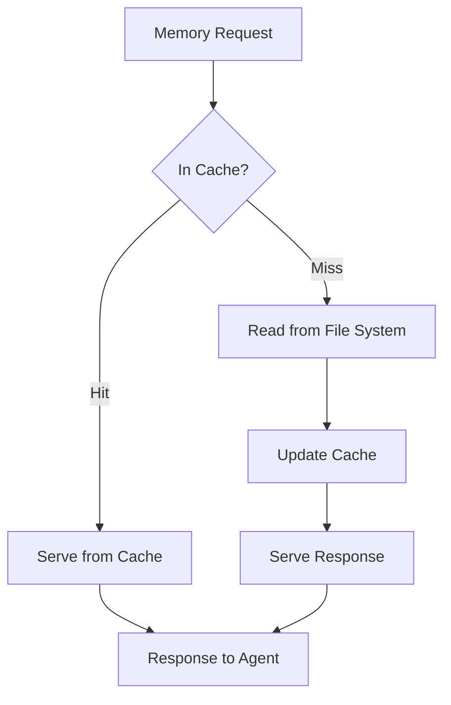

## Security Data Flow

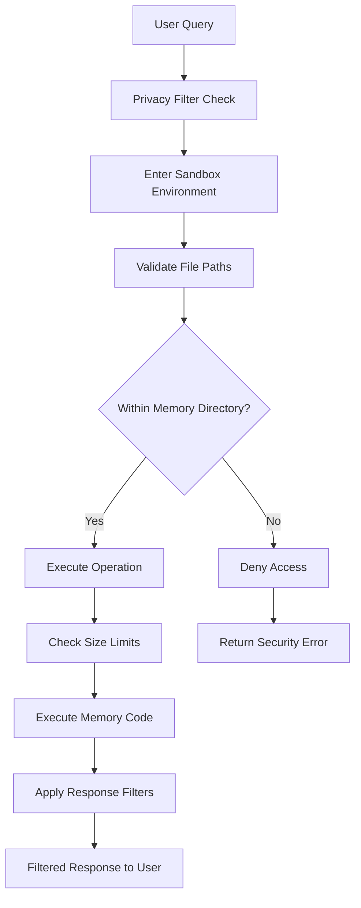

## Configuration Data Flow

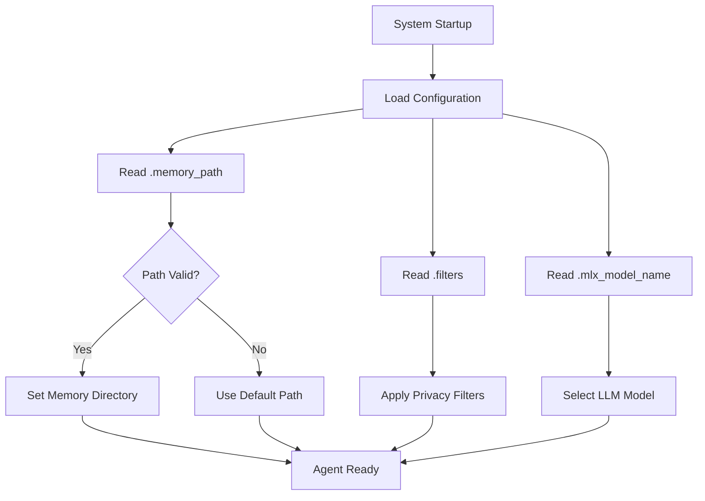

---

*This data flow analysis provides a comprehensive view of how information moves through the Memory Agent MCP system, from user input to persistent storage and response generation. Understanding these flows is crucial for debugging, optimization, and extending the system's capabilities.*
